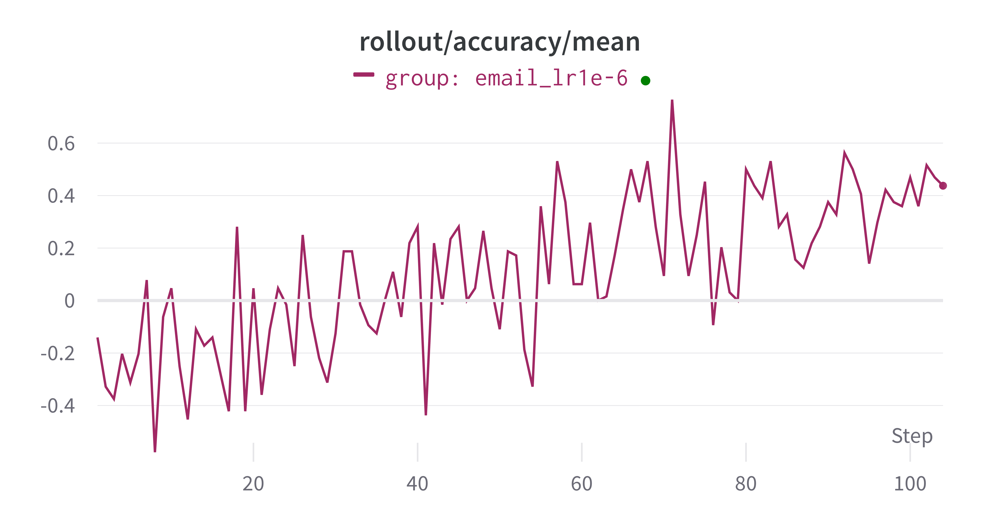
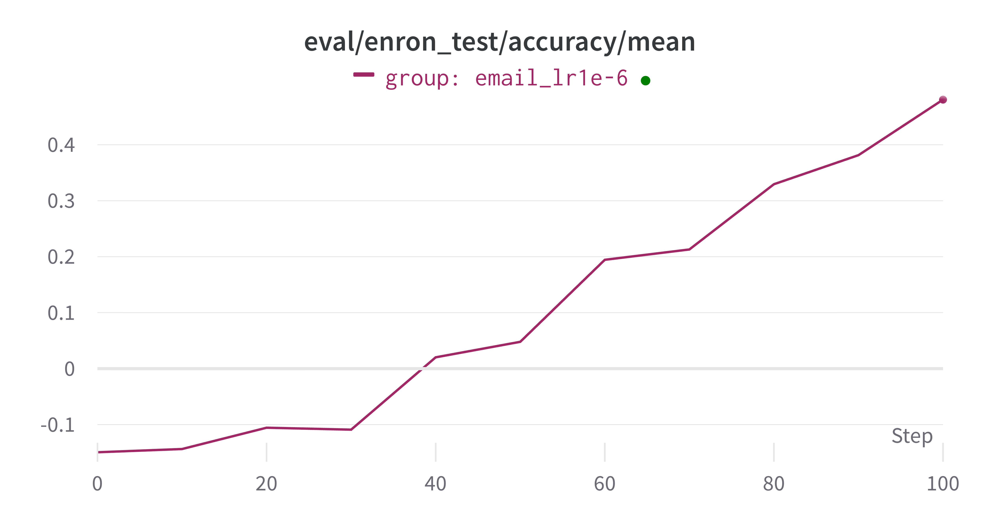

# Email Search Workflow


This example shows a multi-turn email search workflow. We implement a ReAct Agent and define tools for email search. Note that this example rewquires installing `AgentScope==0.1.6`.

## Core Components

We need to define some components:

-   `EmailSearchWorkflow`: The main class that orchestrates the entire process. It initializes the environment, manages the agent, and runs the task.
-   `EmailSearchAgent`: The "brain" of the operation.
    *   It receives the user's query and a system prompt.
    *   It decides which actions to take (e.g., which tool to use).
    *   It is built using the `AgentScope` framework.
-   **Tools**: These are the functions the agent can call to interact with the environment. Based on the code, these tools would likely include:
    *   `search_email`: To find relevant emails.
    *   `read_email`: To read the content of a specific email.
    *   `generate_response`: To provide the final answer when it is found. This tool can be inherited from the `AgentScope` framework.
-   **Judge LLM**: The judge LLM is used to evaluate the agent's performance, defined by `auxiliary_models`.


## Run the Experiments

The config files are located in [`email_search.yaml`](https://github.com/modelscope/Trinity-RFT/tree/main/examples/grpo_email_search/email_search.yaml) and [`train_email_search.yaml`](https://github.com/modelscope/Trinity-RFT/tree/main/examples/grpo_email_search/train_email_search.yaml).
To run this example, you can run the following command:

```bash
trinity run --config examples/grpo_email_search/email_search.yaml
```


## Evaluation Results

The results are shown in the following figure (the accuracy ranges from -0.1 to 1.0):





