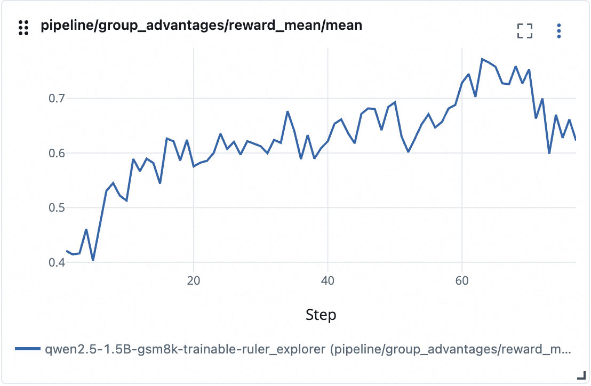
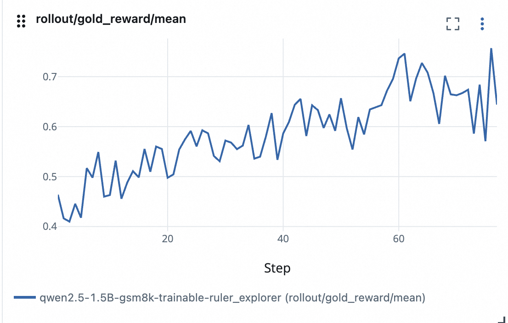
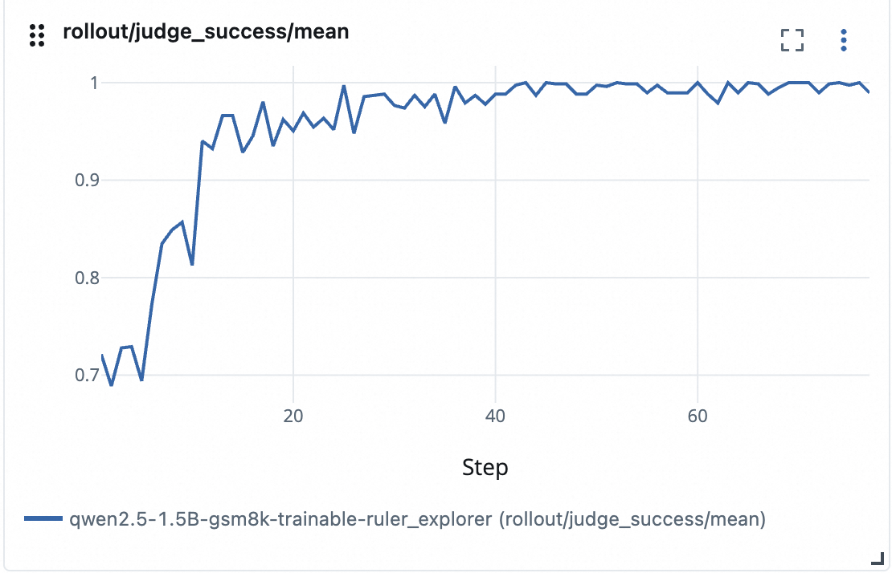
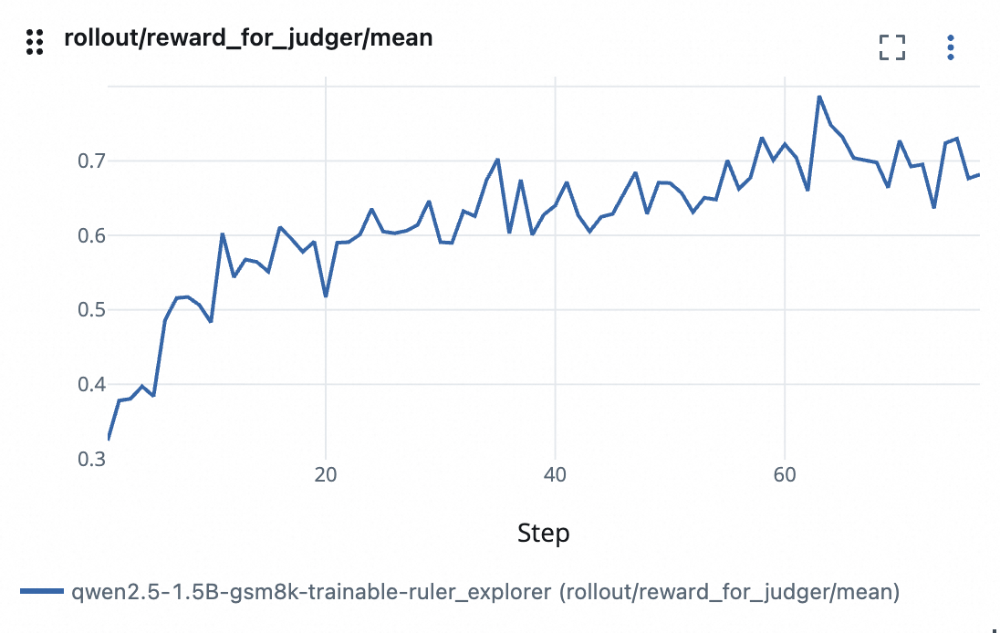
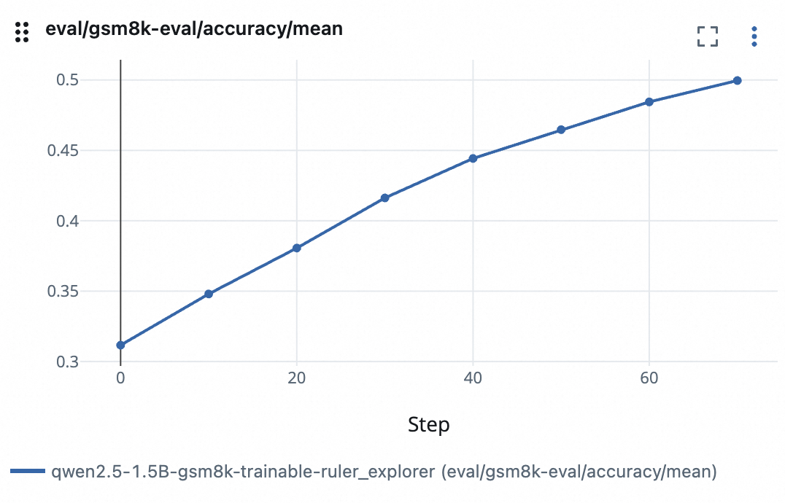

# Policy Model as Its Own Reward Model

Ref: ART's RULER; Kimi-k2.

This example shows an implementation of training a policy model as its own reward model with GRPO, insprired by ART's [RULER](https://art.openpipe.ai/fundamentals/ruler) and KIMI's [K2](https://moonshotai.github.io/Kimi-K2/).

We simulate a scenario where only a fraction (`PROBABILITY_GROUND_TRUTH_AVAILABLE = 0.2`) of tasks have ground-truth answers. We optimize two objectives jointly: one for response generation, the other for RULER-reward generation.

## Configurations and Metrics

The config file is located in [`gsm8k_ruler.yaml`](gsm8k_ruler.yaml).

Some key configs in this example are:

* `default_workflow_type`: set to `math_trainable_ruler_workflow`
* `std_threshold` for GRPO advantage: set to small value, filter out group of experiences with same rewards (e.g., when RULER fails to return valid scores, they are set to all zero)
* `sync_style`: use `dynamic_by_explorer`, due to filtering of experiences
* `train_batch_size`: set to 960; note that one explore step can generate more than 96 * 8 = 768 experiences
* `lr`: set to small value (2e-6) for stability, as rewards can be noisy

Some important metrics to pay attention to are:

* `reward`: reward calculated by rule or by RULER
* `gold_reward`: sum of `accuracy_reward` and `format_reward`, rule-based calculation with ground truth
* `judge_success`: whether RULER successfully returns a valid score (a coarse estimation, mix up two types of experiences)
* `reward_for_judger`: reward for the LLM working as a RULER reward model, calculated by mean absolute error (MAE) distance from gold scores
* `eval_accuracy`: accuracy on the evaluation set (ultimate metric for success of RL)

## Results

We show the results below:

You may compare the above results with [the RULER example](../../examples/grpo_gsm8k_ruler/README.md) with Qwen2.5-32B-Instruct as LLM judge (`auxiliary_models`).

## Potential improvements

As this is a toy example, we may consider some further improvements, including: (a) balance the number of samples for two objectives; and (b) use more sophisticated loss weights for two objectives.
